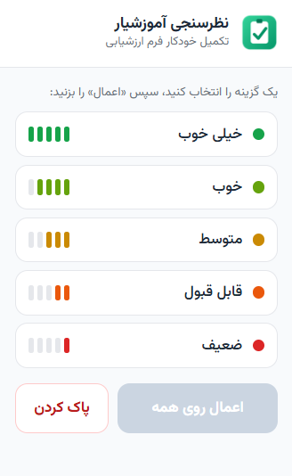

# پرکردن فرم نظرسنجی آموزشیار

<p align="center"></p>

یک افزونه‌ی کروم که فرم ارزشیابی استاد در سامانه آموزشیار را با یک کلیک پر می‌کند.
یک گزینه (خیلی خوب، خوب، متوسط، قابل قبول، ضعیف) را انتخاب می‌کنی و روی همه‌ی سوال‌ها اعمال می‌شود.

## امکانات
- انتخاب یک گزینه و اعمال درجا روی همه‌ی سوال‌ها (بدون اسکرول)
- دکمه‌ی پاک کردن برای ریست همه‌ی پاسخ‌ها
- نمایش وضعیت روی صفحه

دکمه‌ی «ثبت» خودِ صفحه را باید دستی بزنی — افزونه فقط گزینه‌ها را پر می‌کند.

## دانلود
با git:
```bash
git clone https://github.com/phoseinq/amoozeshyar-eval-filler.git
```
یا بدون git: روی دکمه‌ی سبز **Code** بزن → **Download ZIP** و فایل را از حالت فشرده خارج کن.

## نصب
1. `chrome://extensions` را باز کن
2. **Developer mode** را روشن کن
3. **Load unpacked** → پوشه‌ی این پروژه را انتخاب کن
4. در صفحه‌ی فرم نظرسنجی، آیکن افزونه را بزن

## فایل‌ها
- `manifest.json` — تنظیمات افزونه (Manifest V3)
- `popup.html` / `popup.js` — رابط کاربری و منطق پرکردن
- `icon*.png` — آیکن‌ها
